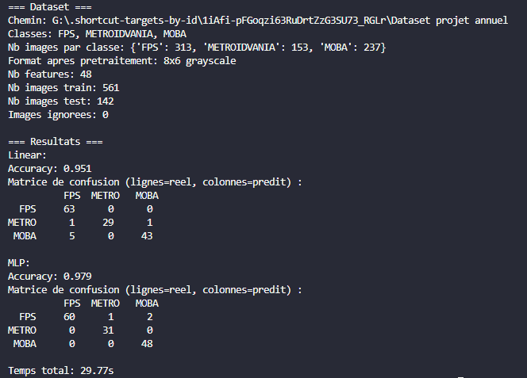
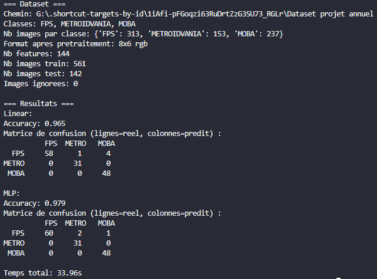
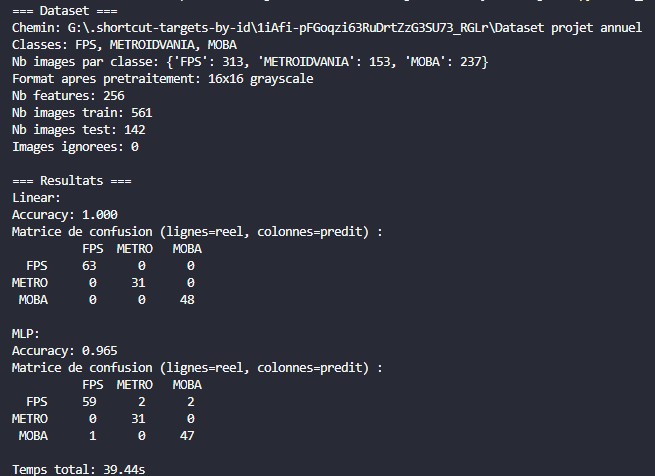
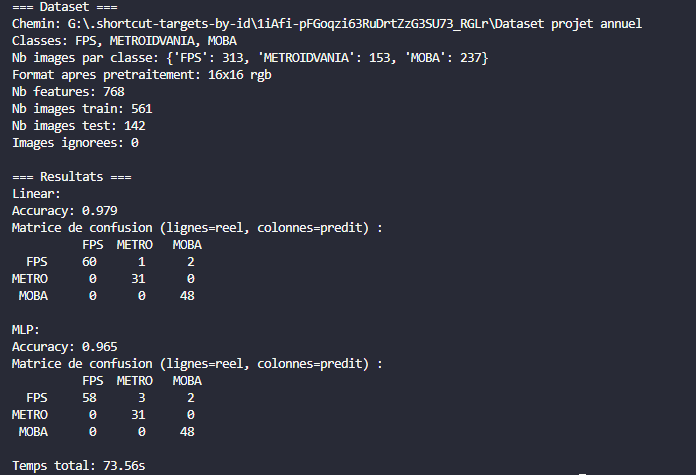
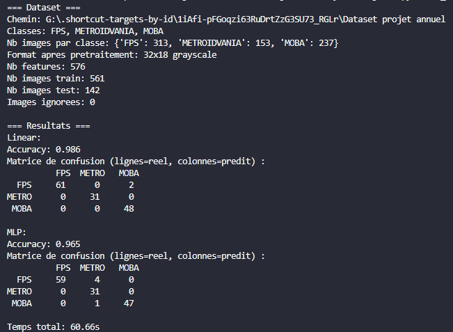
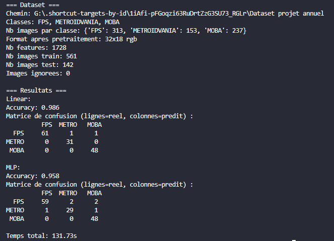

# Rapport dataset

## Objectif

L'objectif de cette partie est de tester nos modèles Rust sur notre dataset de screenshots de jeux vidéo.

Classes utilisées :
- FPS
- METROIDVANIA
- MOBA

Modèles testés :
- modèle linéaire multi-classe 
- PMC / MLP

## Protocole

Découpage du dataset :
- `80%` train
- `20%` test

Le script utilisé pour lancer les tests est :
- `PythonProject/run_dataset.py`

## Commandes utilisées

Se placer dans le dossier Python :

```powershell
cd .\PythonProject
```

Exemples de commandes testées :

```powershell
py .\run_dataset.py
py .\run_dataset.py --rgb
py .\run_dataset.py --width 16 --height 16
py .\run_dataset.py --width 32 --height 18 --rgb
```

## Tests retenus

### Test 1

Configuration :
- taille : `8x6`
- mode : `grayscale`

Screenshot du terminal :



### Test 2

Configuration :
- taille : `8x6`
- mode : `RGB`

Screenshot du terminal :



### Test 3

Configuration :
- taille : `16x16`
- mode : `grayscale`


Screenshot du terminal :



### Test 4

Configuration :
- taille : `16x16`
- mode : `RGB`

Screenshot du terminal :



### Test 5

Configuration :
- taille : `32x18`
- mode : `grayscale`

Screenshot du terminal :



### Test 6

Configuration :
- taille : `32x18`
- mode : `RGB`

Screenshot du terminal :



## Tableau récapitulatif

| Configuration     | Nb features | Accuracy linéaire | Accuracy MLP | Temps total |
|-------------------|------------:|------------------:|-------------:|------------:|
| `8x6 grayscale`   | `48`        | `0.951`           | `0.979`      | `29.77s`    |
| `8x6 rgb`         | `144`       | `0.965`           | `0.979`      | `33.96s`    |
| `16x16 grayscale` | `256`       | `1.000`           | `0.965`      | `39.44s`    |
| `16x16 rgb`       | `768`       | `0.979`           | `0.965`      | `73.56s`    |
| `32x18 grayscale` | `576`       | `0.986`           | `0.965`      | `60.66s`    |
| `32x18 rgb`       | `1728`      | `0.986`           | `0.958`      | `131.73s`   |

## Observation finale

Sur les tests effectués, le modèle linéaire obtient de très bons résultats sur notre dataset, et atteint même `1.000` d'accuracy en `16x16 grayscale`. Cela suggère que, sur l'état actuel du dataset, les classes sont déjà bien séparables à partir de caractéristiques visuelles globales.

Le MLP fonctionne également correctement même si ses résultats restent légèrement en dessous sur les résolutions les plus élevées. Cela peut s'expliquer par le fait que le dataset reste de taille modeste et qu'un modèle plus complexe ne bénéficie pas forcément d'un plus grand nombre de features.

Le passage de `grayscale` à `rgb` augmente fortement le nombre de features et le temps d'exécution, sans amélioration nette des performances. Dans nos tests, le `rgb` n'apporte donc pas de bénéfice clair par rapport au coût supplémentaire.

L'augmentation de résolution améliore les résultats jusqu'à un certain point, mais au-delà, le gain devient faible voire nul. La configuration `16x16 grayscale` apparaît comme le meilleur compromis entre précision, simplicité et temps d'exécution.

Enfin, les erreurs observées concernent surtout la confusion entre `FPS` et `MOBA`, alors que la classe `METROIDVANIA` est globalement très bien reconnue. Cela laisse penser que certaines caractéristiques visuelles de `METROIDVANIA` sont plus distinctives dans notre dataset actuel.
