### jour 1 : 
décryptage du code de classification Linéaire 
compréhension de la méthode de la génération de données, de l'affichage, du découpage 

### jour 2 : (plusieurs nuit ce sont passé entre les jours)
compréhension de l'entrainement :
on pioche aléatoirement une données
on créer un tuples de 3 avec 1 puis les position de la données
on prend le label de la données pour savoir si c'est bon ou pas(1 ou -1) 
on utilise un produit scalaire pour ressortir un 1 ou -1
on met à jour W selon les résultats obtenu auparavant 

### jour 3 : 
Meilleur compréhension de l'entrainement : 
le 1 du tuple de 3 sert de vérification 
la fonction linéaire fait un produit scalaire pour savoir quel est l'état de w selon la donnée
mise à jour de w --> si bon label et bon positionnement --> aucun changement, sinon mise à jour selon un pas d'apprentissage et le tuple de la données actuel

### jour 4 : 
semblant de compréhension de w [x :f32, y : f32, z : f32] --> une droite de y à z qui débute à x hauteur 

### jour 5 (et plus)
écriture du programme en python et de la lib rust 
problème rencontrer : mal compréhension de ctype	--> déclarer à chaque fois les return des fonctions
							--> déclarer des variables en entrée 
							--> précision des valeur avec dtype (float, int)
les fonctions de la lib n'accepte que les structures "simple" (donc pas les tuples)

### jour 6 : 
continuation du code ! :
au lieu d'utiliser une lib : produit scalaire "simple" : weights1*xinput1 + weights2*xinput2 + weights3*xinput3
complication de la fonction d'entrainement --> pas de tuples à l'entrée mais utilisation d'une structure avec les 3 point [x, y, z]
ça marche ! 

### jour 7: 
Notebook cas de test : 
complétion du code utiliser auparavant pour faire les cas de test
mal compréhension de l'ensemble des données, des test à effectuer
modification du code données avec les dtypes
modification de la lib pour ajouter le pas d'apprentissage lors de l'entrainement
mise en place d'un trait noir pour voir la séparation

réussite du cas de test linear simple

### jour 8 : 
tes du reste du Notebook : 
Linear Multiple : entrainement ne marche pas, les valeurs n'arrête pas d'évoluer 
		--> changement du pas d'apprentissage
		--> changement de la librairie sur l'apprentissage
		le trait noir semble être bonne, mais l'axe ait mauvais 
XOR :
test sans suite

Muti Linear 3 classes : 
test sans suite 

### jour 9 (17/05/2026) :
résolution du bug concernant le **Linear Multiple**. Pour rappel, le trait créer semblais décalé à l'horizontal par rapport au données.
Pour résoudre le problème, j'ai d'abord différencier **Linear Simple** avec mon code, cependant ça semblais correspondre. 
Donc je me suis dit que le problème venais de la création des données

Les données semblait correct (liste de liste contenant 2 valeurs). Mais les données donnant le résultats (1 ou -1) est en liste de liste d'une valeur. Alors que du coté du linear simplex, c'est une liste de valeur.
L'entrainement regadrais donc une liste de liste au lieu d'une simple liste. 

Après avoir corrigé les données entrantes, le code s'est mis à fonctionner (avec des valeur d'entrainement et de pas d'apprentissage plus réalisable que mes précédent test).
Je réaliserais des tests sur le pas d'entrainement et sur le nombre de tour plus tard

## jour 10 (24/05/2026) : 
- Mise en place du **Linear Simple** sur le cas **XOR** : 
  - Dans la théorie, une droite ne pourrais pas faire la classification d'un xor. 
  - Dans la pratique, on vois bien sur le graphique que la ligne n'arrive jamais à correctement classifier
  
- Mise en place du **Linear Simple** sur le cas **Cross** :
  - Dans la théorie, une droite ne suffis pas à séparer les 2 classes
  - Dans la pratique, quand ça fonctionne bien (bug expliqé après) la droite coupe à la vertical le jeu de données, mais n'arrive séparer les 2 classes.
  - Bug remarqué, lors de mes tests, 2 fois sur 3 je n'avais pas de résultats (pas = 0.01, boucle = 2000 (oui j'y allais un peu fort)). J'ai décidé d'afficher les poids et j'ai remarqué que le poid w.b équivalais à "nan".
Après avoir redémarer mon pc, je n'arrive plus à reproduire l'erreur. Peut être que c'était dû à une surcharge matériel?

- Mise en place du **Linear Simple** sur le cas **Multi Linear 3 classes** :
  - Dans la théorie, une droite ne suffirais pas à classifier 3 classes. 2 droite pourrais fonctionner avec -1 (pour la classes du dessous) correspondant à une classes, et 1 de la 1 ère droite & 1 de la 2 ème droite équi vaut à la 3 ème classes.
En regardant mieux le graphique, j'ai vu qu'une droite à l'horizontale pourrais rerésenter la classes rouge, donc 3 droite pourrais "facilement" représenter les 3 classes.
  - Dans la pratiques, après avoir implémenter l'entrainement sur 3 droite avec toutes les données, j'ai remarqué que l'entrainement ne marchais pas. Il faudrais surrement donné à chaque droite seulement 2 classes (bleu et les autres, rouge et les autres ou vert et les autres).

  - Bug remarquer, retour du "nan". Après des recherche, j'ai compris que "nan" signifiait "Not a Number". Nan intervient quand le float deviens bien trop grand, donc pour limiter son apparttion je dois faire évoluer les poids d'un façons plus douce en faisant moins de boucle, ou en réduisant le pas d'apprentissage.

  
### ___________________________________________________________________________________________________________________________________

## exp 1 
- utilisation de valuer pris au hasard  
  - parametre
    - epochs = 1_000
    - pas_apprentissage = 0.0001
    - batch_size_like = 100000
    - liste seed :[12, 24, 42, 5, 59]
  - résultat
    - accuracy :  moyene : 0.886, seed 42 : 0.912
    - Allé retour Python <-> Rust : 14.93
    - 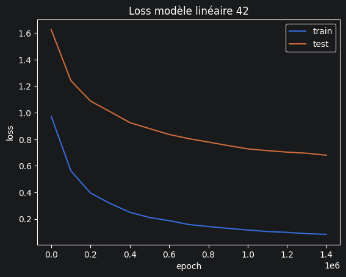
  - obsetvation
    - un beau 91% d'accuracy, pourtant, on trouve aussi 70% de loss. Le faite de tester avec plusieurs seed aide beaucoup
    - je voulais juste garder ces valeurs, maintenant commençons de 0

## exp 2
- Repartons de 0 avec un batch_size grand pour fluidifier le calclul
- un pas d'apprentissage petit qu'on réduira lors des test
- et une petrit epoch (100) pour voir ce que ça donne
  - parametre
    - epochs = 100
    - pas_apprentissage = 0.1
    - batch_size_like = 10000
    - liste seed :[12, 24, 42, 5, 59]
  - résultat
    - accuracy :  moyene : 0.28
    - loss : rien
    - Allé retour Python <-> Rust : 14.93
    - 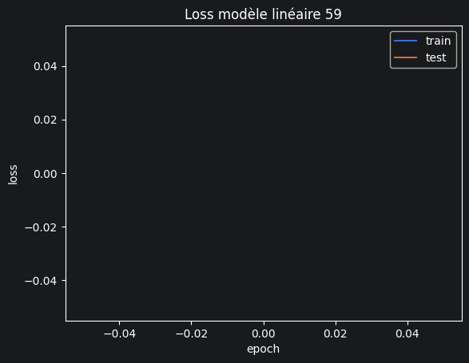
  - obsetvation
    - rien de bon pour l'instant, le modèle ne s'entraine juste pas, j'ai peut être mis un batch_size trop grand
    - essayons avec un plus petit (/10) pour au moins avoir un visuel

## exp 3
- auglenton le nombre d'epoch
  - parametre
    - epochs = 100
    - pas_apprentissage = 0.1
    - batch_size_like = 100
    - liste seed :[12, 24, 42, 5, 59]
  - résultat
    - accuracy :  moyene : 0.28
    - loss : rien
    - Allé retour Python <-> Rust : 149.3
    - 
  - obsetvation
    - toujour rien, le modèle n'a pas le temps de s'entrainer ?
    - 100 epoch est surrement tro ppetit, faisont un *10

## exp 4
- plus d'epoch
  - parametre
    - epochs = 1000
    - pas_apprentissage = 0.1
    - batch_size_like = 10000
    - liste seed :[12, 24, 42, 5, 59]
  - résultat
    - accuracy :  moyene : 0.28
    - loss : rien
    - Allé retour Python <-> Rust : 149.3
    - 
  - obsetvation
    - toujour rien, le modèle a trop de pas d'entraine ?
    - augmenton divison par 10 celui ci 

## exp 5
- test avec 0.01 de pas d'entrainement
  - parametre
    - epochs = 1000
    - pas_apprentissage = 0.01
    - batch_size_like = 10000
    - liste seed :[12, 24, 42, 5, 59]
  - résultat
    - accuracy :  moyene : 0.28
    - loss : rien
    - Allé retour Python <-> Rust : 149.3
    - 
  - obsetvation
    - toujour rien
    - normalement, on devrais voir une évolution
    - en regadant dans le .json, je vois que le train_loss, test_loss et les poids ont des Nan
    - [json](C:\Users\theot\Documents\rust_prog\Annual-Project-ESGI-\project\PythonProject\save_model\linear\model_linear_pas0.01_batch_size10000_seed24.json)
    - donc il y a eu une erreur de calcul
    - cette erreur arrive car les poids innitialiser aléatoirement et ensuite calculer avec le pas d'apprentissage évolue trop vite et atteind la limite du type float
    - réduisont le pas d'apprentissage petit à petit

## exp 6
- partons sur 0.001 de pas
  - parametre
    - epochs = 1000
    - pas_apprentissage = 0.001
    - batch_size_like = 100000
    - liste seed :[12, 24, 42, 5, 59]
    - Allé retour Python <-> Rust : 14.93
  - résultat
      - meilleur résultat seed 5:
        - accuracy : 0.922
        - matrice        FPS  METRO   MOBA
                  FPS     91     12      5
                METRO      3    143      2
                 MOBA      1      6    111
        - 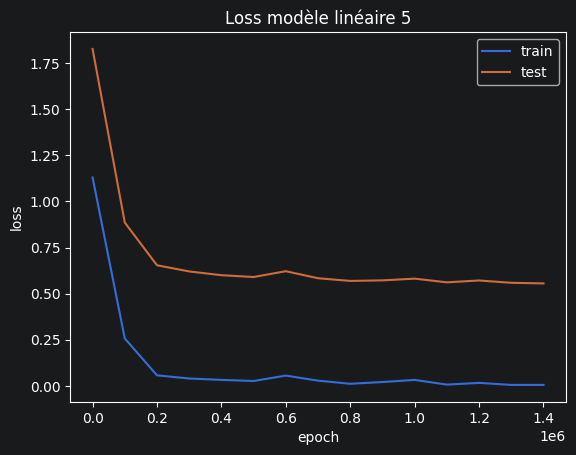
      - résultats représentatife seed 24 :
        - accuracy 0.917
        - matrice        FPS  METRO   MOBA
                  FPS     88     12      8
                METRO      3    144      1
                 MOBA      1      6    111
        - 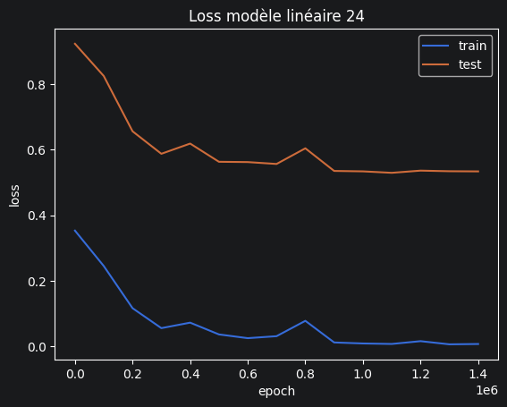
  - obsetvation
    - des résultats déjà intéressant avec 91% d'accuracy
    - on voit qu'avec les même modèle mais pas avec la même seed que les résultats puevent bien changer
    - au niveau de a seed 5, il y a quelque erreur au niveau de la matrice, plus spécifiquement au niveau des fps qui se font voir comme des metroidvania
    - on ne dirait pas que le loss baisse avec le temps, afficher plus de point pourrais être intéressant
    - coté seed 24, on à le même problème de matrice (qui se répète sur les autre test)
    - la courbe de loss est moins basse, à eu un petit pick mais rien de grave avec cette visualisation
    - relançon les modèle avec plus de moins pour mieux visualiser 

## exp 7
- partons batch_size /10
  - parametre
    - epochs = 1000
    - pas_apprentissage = 0.001
    - batch_size_like = 10000
    - liste seed :[12, 24, 42, 5, 59]
    - Allé retour Python <-> Rust : 149.3
  - résultat
      - meilleur résultat seed 5:
        - 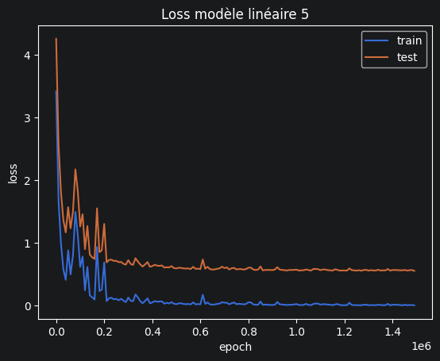
      - résultats représentatife seed 24 :
        - 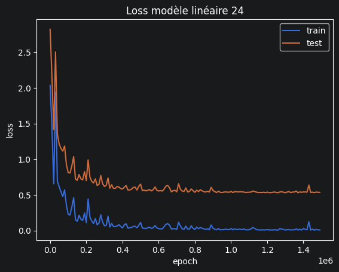
  - obsetvation
    - on vois mieux l'entrainement 
    - le modèle apprend au début et stagne à la fin
    - réduison le pas d'apprentissage pour voir s'il y a une amélioration

## exp 8
- partons sur 0.0001 de pas
  - parametre
    - epochs = 1000
    - pas_apprentissage = 0.0001
    - batch_size_like = 100000
    - liste seed :[12, 24, 42, 5, 59]
    - Allé retour Python <-> Rust : 149.3
  - résultat
      - meilleur résultat seed 42:
        - accuracy : 0.912
        - matrice        FPS  METRO   MOBA
                  FPS     87     10     11
                METRO      2    144      2
                 MOBA      4      4    110
        - 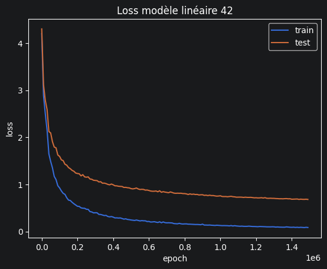
      - résultats représentatife seed 5 :
        - accuracy 0.882
        - matrice        FPS  METRO   MOBA
                  FPS     85     15      8
                METRO      6    138      4
                 MOBA      2      9    107
        - 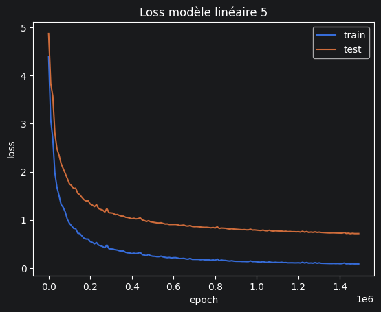
  - obsetvation
    - les résultats sont moins bon et on voit que l'entrainement commence de très haut (pas moins haut)
    - j'ai envie d'essayer plus d'epoch avec 0.0001 et 0.001 de pas

## exp 9
- partons 0.001 avec 10000 epoch
  - parametre
    - epochs = 10000
    - pas_apprentissage = 0.001
    - batch_size_like = 100000/6.7
    - liste seed :[12, 24, 42, 5, 59]
    - Allé retour Python <-> Rust : ~100
  - résultat
      - meilleur résultat seed 5:
        - accuracy : 0.917
        - matrice        FPS  METRO   MOBA
                  FPS     91     13      4
                METRO      4    142      2
                 MOBA      2      6    110
        - 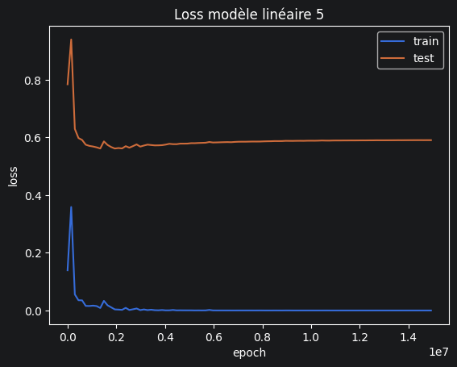
      - résultats représentatife seed 42 :
        - accuracy 0.904
        - matrice        FPS  METRO   MOBA
                  FPS     88     11      9
                METRO      7    140      1
                 MOBA      2      6    110
        -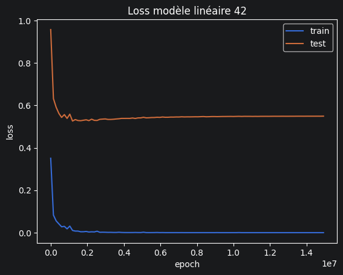
  - obsetvation
    - on voit un début de sur-apprentisage à partit de 0.4 (1e7) epoch car la courbe de test semble augmenter
    - je continu sur un pas de 0.0001 pour voir les résultats voir que faire après

## exp 10
- partons 0.0001 avec 10000 epoch
  - parametre
    - epochs = 10000
    - pas_apprentissage = 0.0001
    - batch_size_like = 100000/6.7
    - liste seed :[12, 24, 42, 5, 59]
    - Allé retour Python <-> Rust : ~100
  - résultat
      - meilleur résultat seed 42:
        - accuracy : 0.92
        - matrice        FPS  METRO   MOBA
                  FPS     92      7      9
                METRO      7    141      0
                 MOBA      3      4    111
        - 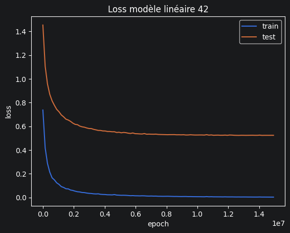
      - résultats représentatife seed 12 :
        - accuracy 0.906
        - matrice        FPS  METRO   MOBA
                  FPS     91     11      6
                METRO      5    140      3
                 MOBA      5      5    108
        - 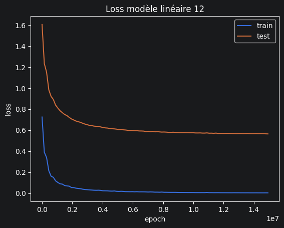
  - obsetvation
    - on observe une légère amélioration au niveau du loss de la courbe de test
    - l'accuracy à un peu baisser, mais mieux vaux explorer encore vers un pas d'apprentissage plus petit
    - le nombre d'epoch semble convainquante, le modèle n'append plus trop

## exp 11
- partons 0.00001 avec 10000 epoch
  - parametre
    - epochs = 10000
    - pas_apprentissage = 0.00001
    - batch_size_like = 100000/6.7
    - liste seed :[12, 24, 42, 5, 59]
    - Allé retour Python <-> Rust : ~100
  - résultat
      - meilleur résultat seed 42 :
        - accuracy : 0.912
        - matrice        FPS  METRO   MOBA
                  FPS     89      9     10
                METRO      3    143      2
                 MOBA      5      4    109
        - 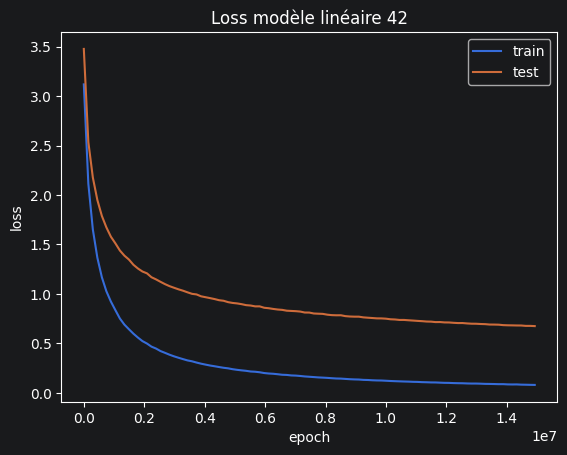
      - résultats représentatife seed 5 :
        - accuracy 0.882
        - matrice        FPS  METRO   MOBA
                  FPS     85     14      9
                METRO      6    137      5
                 MOBA      2      8    108
        - 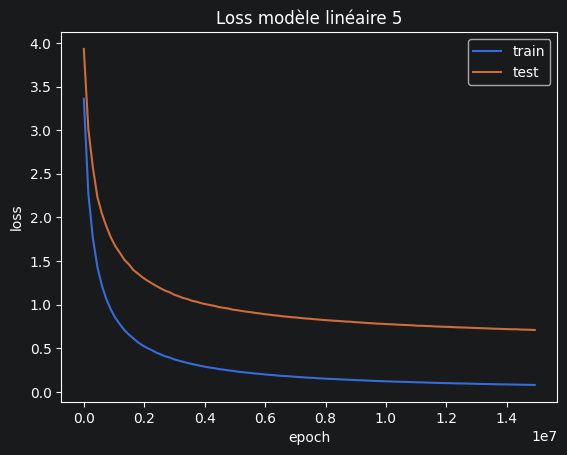
  - obsetvation
    - on observe une dessente, donc plus d'epoch serais à essayer *10
    - néanmoins les modèles donne moins de résultats pour le moment
    - les précédent modèle tendait vers 0.6, hors ici on se rapproche plus du 0.75
    - peut être que plus on met u pas petit, plus les résultats deviennet intéressant avec un grand nombre d'epoch 

## exp 12
- partons 0.00001 avec 100000 epoch
  - parametre
    - epochs = 100000
    - pas_apprentissage = 0.00001
    - batch_size_like = 100000000/6.7
    - liste seed :[12, 24, 42, 5, 59]
    - Allé retour Python <-> Rust : ~100
  - résultat
      - meilleur résultat seed 5 :
        - accuracy : 0.925
        - matrice        FPS  METRO   MOBA
                  FPS     92     12      4
                METRO      3    143      2
                 MOBA      1      6    111
        - 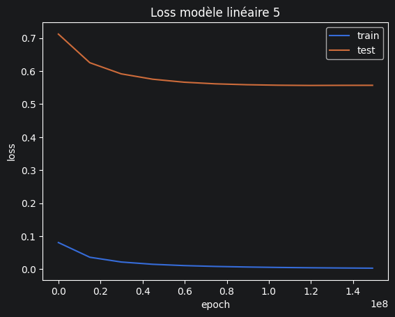
      - résultats représentatife seed 42 :
        - accuracy 0.920
        - matrice        FPS  METRO   MOBA
                  FPS     92      7      9
                METRO      7    141      0
                 MOBA      3      4    111
        - 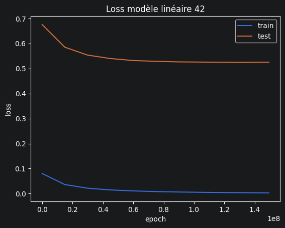
  - obsetvation
    - 24 min d'entrainement 
    - des résultats bon en train : 0.0029 en loss
    - des résultats moins bon en test : 0.5569
    - n'apprend plus au 7 ème "batch" du test
    - mais apprend continuellement en test, on rentre en sur-apprentissage
    - le modèle linéaire ne semble pas apprendre pour le train
    - vu le nombre de temsp pour un test, réduisont le nombre d'epoch et essayon de réduire encore le pas d'apprentissage, vu qu'avec un plus grand pas tout fonctionne

    
## exp 13
- essayons moins d'epoch pour plus d'apprentissage
  - parametre
    - epochs = 100000
    - pas_apprentissage = 0.000001
    - batch_size_like = 100000000/6.7
    - liste seed :[12, 24, 42, 5, 59]
    - Allé retour Python <-> Rust : ~10
  - résultat
      - meilleur résultat seed 5 :
        - accuracy : 0.880
        - matrice        FPS  METRO   MOBA
                  FPS     83     15     10
                METRO      6    138      4
                 MOBA      2      5    108
        - 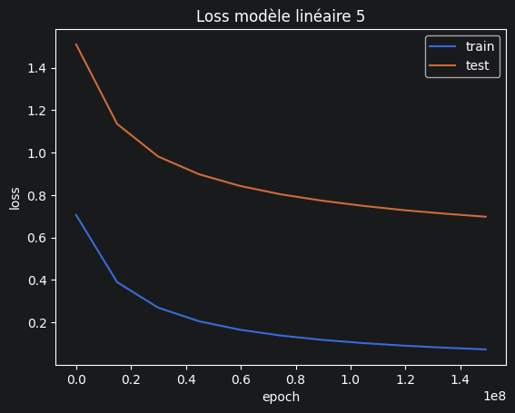
  - obsetvation
    - des résultas intéressant qui pousse à l'exploration
    - je vais lancer une autre fois avec plus d'epoch, mais ça prendra bien plus de temps 
    - 

## exp
- 
  - parametre
    - epochs = 100
    - pas_apprentissage = 0.0001
    - batch_size_like = 100000
    - liste seed :[12, 24, 42, 5, 59]
  - résultat
    - accuracy :  moyene : , seed  : 
    - Allé retour Python <-> Rust : 
    - !
  - obsetvation
    - 