# MODELE PMC (ou MLP)

## Expérimentations

Choix d'hyperparamètres assez aléatoires au début:

### Variation de tailles des couches cachées

#### 1er test
- learning rate : 0.001
- steps : 1 000 000
- couches cachées : 5, 5

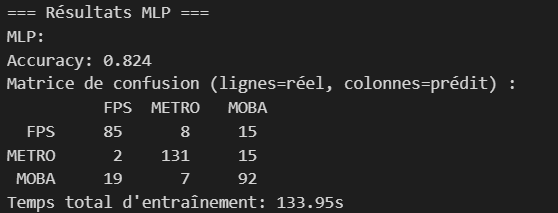

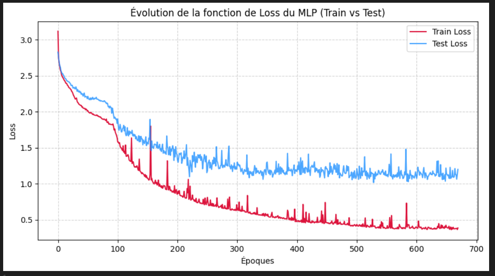

#### 2e test

- learning rate : 0.001
- steps : 1 000 000
- couches cachées : 16, 16

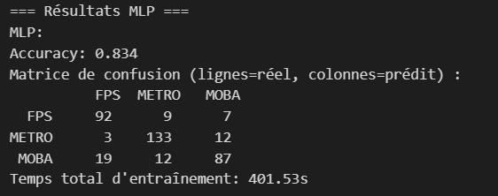

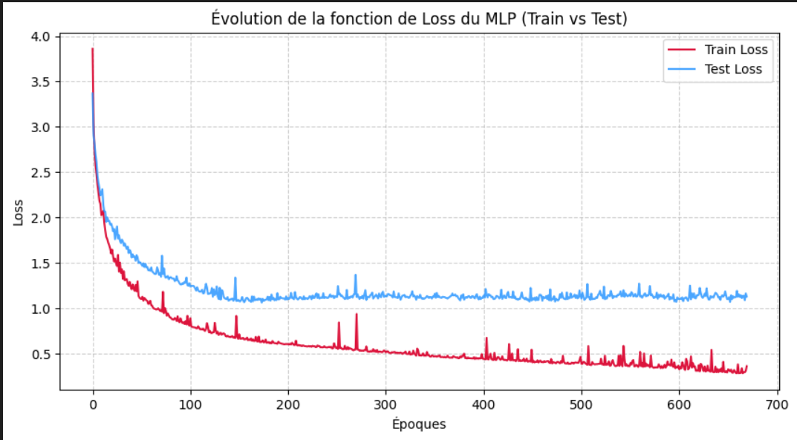

> on peut observer une légère amélioration des résultats et de l'accuracy

#### 3e test

- learning rate : 0.001
- steps : 1 000 000
- couches cachées : 24, 24

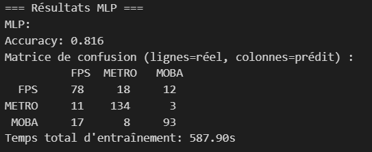

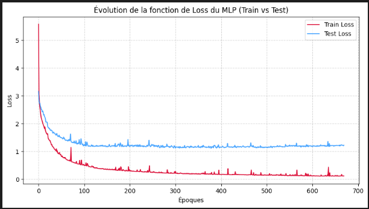

> convergence plus rapide mais moins bonne accuracy, courbes de loss plus stables et valeurs de loss bien plus faibles

- observations : + grandes couches cachées ne dit pas meilleure accuracy mais cela semble diminuer la volatilité des variations de loss

### Variation du nombre de couches cachées

#### 4e test

- learning rate : 0.001
- steps : 1 000 000
- couches cachées : 5, 5, 5

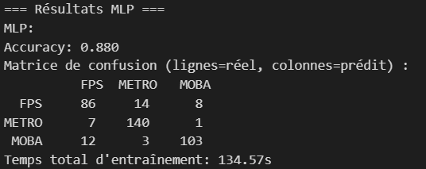

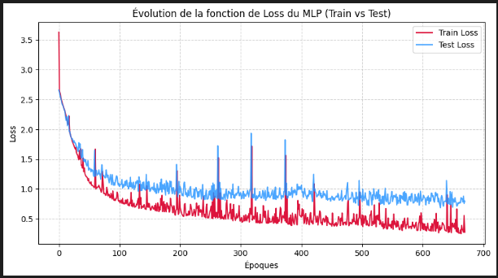

> meilleure accuracy, courbes de loss très volatiles, valeurs de loss assez faibles

#### 5e test

- learning rate : 0.001
- steps : 1 000 000
- couches cachées : 16, 16, 16

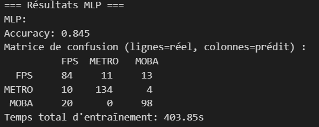

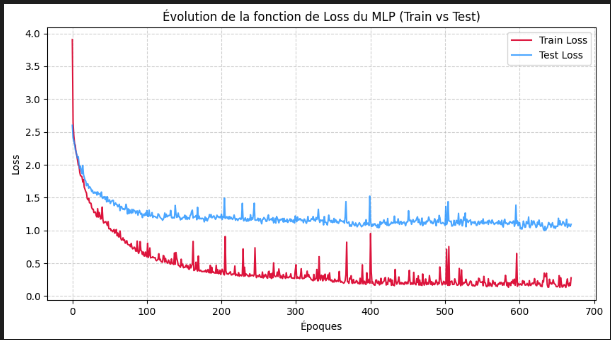

> moins bonne accuracy, courbes de loss plus stables, valeurs de loss bien plus élevées sur le test set

### test de variation du learning rate

#### 6e test

- learning rate : 0.01
- steps : 1 000 000
- couches cachées : 16, 16, 16

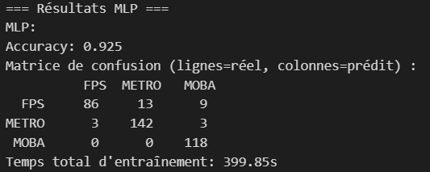

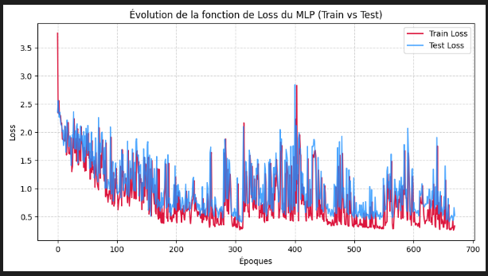

> bien meilleure accuracy, cependant des courbes de loss extrêmement instables

#### 7e test

- learning rate : 0.0001
- steps : 1 000 000
- couches cachées : 16, 16, 16

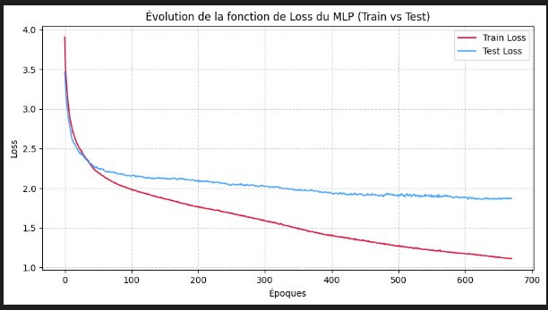

> La pire accuracy et la pire loss depuis le début des tests, mais les courbes de loss sont très stables

- Conclusion variation learning rate :
  ni un learning rate très faible (0.0001) ni un learning rate très fort (0.01) ne semblent égaler les performances du learning rate à 0.001 pour le loss particulièrement

#### 8e test

- learning rate : 0.005
- steps : 1 000 000
- couches cachées : 16, 16, 16

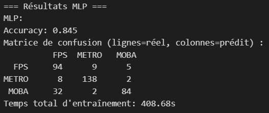

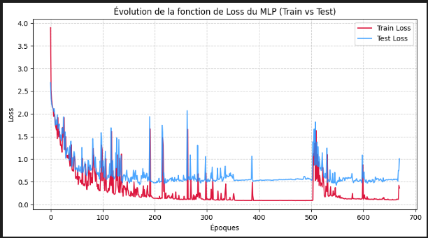

> accuracy proche de celle des premier tests, bonnes valeurs de loss, mais encore trop de volatilité pour le loss

#### 9e test

- learning rate : 0.002
- steps : 1 000 000
- couches cachées : 16, 16, 16

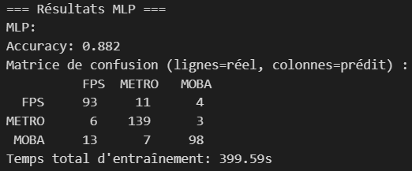

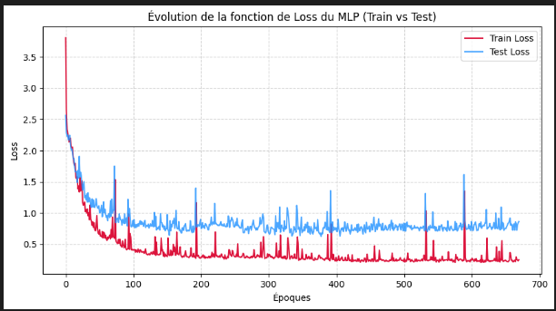

> plutôt bonne accuracy, meilleure stabilité du loss comparativement au test précédent

## Conclusion

J'ai gardé le modèle avec ces paramètres :

Car il montrait les meilleurs résultats au final.

|-|test 1|test 2|test 3|test 4|test 5|test 6|test 7|test 8|test 9|test 10|
|:---:|:---:|:---:|:---:|:---:|:---:|:---:|:---:|:---:|:---:|:---:|
|accuracy|0.824|0.834|0.816|0.88|0.845|0.925|0.687|0.845|0.882|
|loss train|0.35|0.35|0.05|0.3|0.2|0.3|1.1|0.1|0.25|
|loss test|1.2|1.15|1.15|0.8|1.1|0.5|1.9|0.5|0.8|
|variation des courbes de loss|normales|faibles|très faibles|fortes|normales|très fortes|très faibles|fortes|normales|
